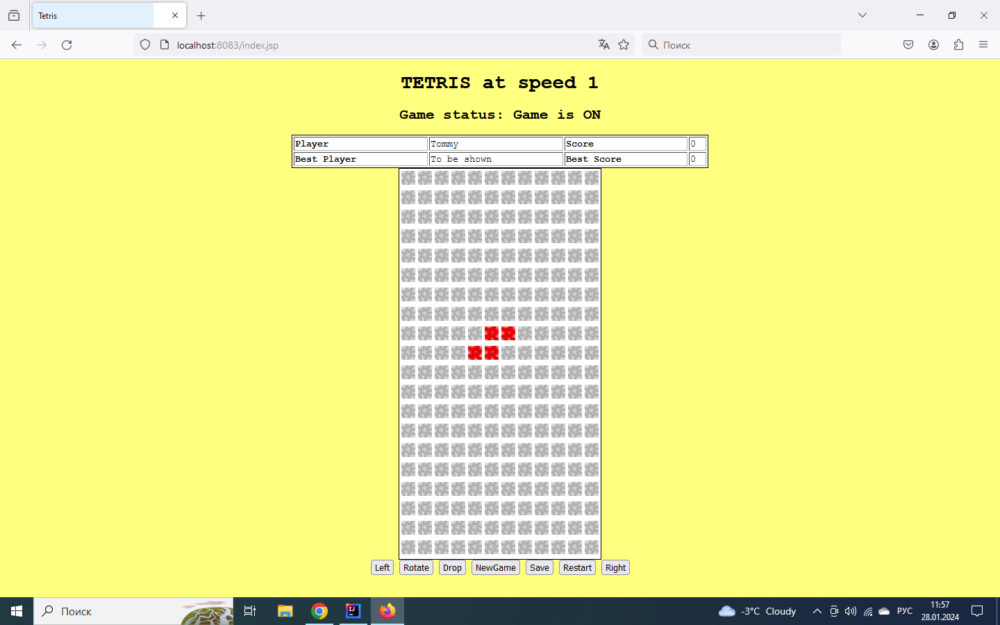

Java Tetris Game

************************************************************************************************************************
 run 'tomcat9TetrisGameLaunch' to play the game

the player's name is selected randomly, the player's score is calculated as each filled row collapses
 - the game status is shown and changes as the game is saved or is over
 - use the relevant buttons to move left, right, rotate, drop down the tetramino or the arrow keys respectfully LEFT,RIGHT,UP,DOWN
 - use NewGame button to cancel the current game and start the new game
 - use Save button to save the current game, the game new status then will be shown as 'the Game is SAVED'
 - use Restart button to call and continue to play the saved game

 - the current player name and score are shown
 - as the game is over the current results are saved in the Data base and the best player and the best player's score are selected then and shown

 - the game speed increases along with the player's score and is shown

************************************************************************************************************************

The project uses the following technologies:

- Spring IOC / Dependency Injection
- Spring Java Config
- Spring Web MVC
- Tomcat server 9.0
- Serialization
- PostgreSQL
- JSP
************************************************************************************************************************
Java Tetris Tests

There are 16 tests which provide for the game units' functionality:

 - run the following maven command to start unit tests: 
 
mvn -Dlog4j.configuration=file:C:\JavaProjects\2\Tetris-New\src\test\resources\log4j.properties -DsuiteXml=testng-unit-tests.xml clean test
 
 - each test method is logged for debugging pls find the unit tests log in \target\logs\quality-automation.log

************************************************************************************************************************
Pls find 8 api tests which make sure that each defined client request receives successful response from the server and
7 more api tests checking if response bodies are in accordance with client requests

 - run tomcat9TetrisServerLaunch
 - run the following maven command to start api tests: 

mvn -Dlog4j.configuration=file:C:\JavaProjects\2\Tetris-New\src\test\resources\log4j.properties -DsuiteXml=testng-api-tests.xml clean test

 - the test method is logged for debugging pls find the api tests log in \target\logs\quality-automation.log

************************************************************************************************************************
Run All tests

- run tomcat9TetrisServerLaunch
- run the following maven command to run all tests: 

mvn -Dlog4j.configuration=file:C:\JavaProjects\2\Tetris-New\src\test\resources\log4j.properties -DsuiteXml=testng-all-tests.xml clean test